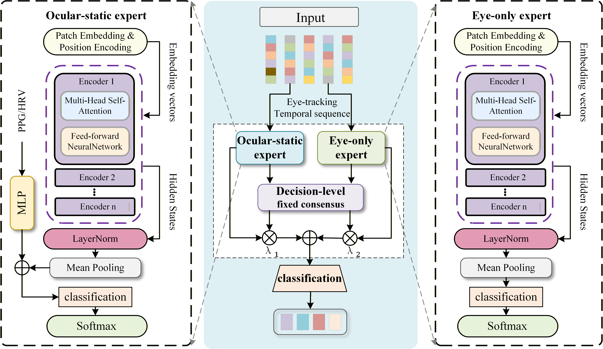
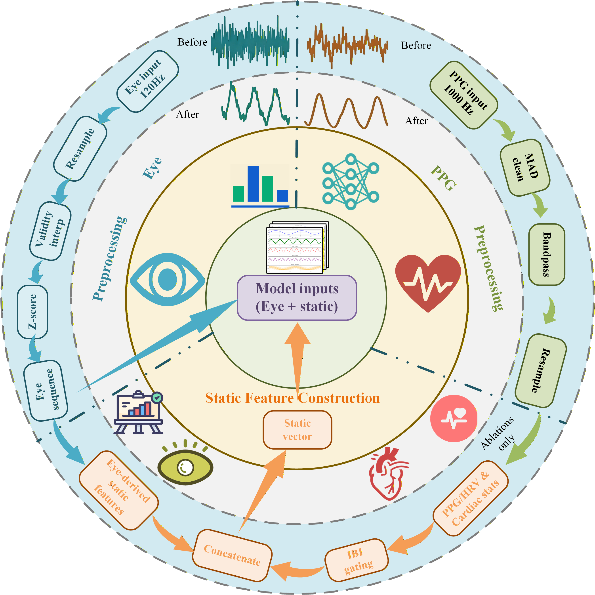

# PF-OS

Official code implementation and supplementary material for **PF-OS: Ocular-Dominant Workload Sensing for Adaptive Virtual Reality Displays**. This work proposes an ocular-dominant workload sensing framework for adaptive VR displays. PF-OS uses eye-tracking as the primary short-window temporal evidence and incorporates photoplethysmography/heart-rate-variability information as conservative static context.

The reported operating point is a dual-expert consensus model: a primary ocular-static expert and a matched eye-only expert. The framework is designed for 10-second cognitive workload decoding under subject-wise evaluation.



**Dual-expert architecture.** The framework consists of a primary ocular-static expert and a matched eye-only expert. The ocular-static expert extracts temporal representations from the eye-tracking sequence using a shared Transformer encoder and integrates engineered static features derived from eye-tracking and photoplethysmography/heart-rate-variability signals via feature-level concatenation. The eye-only expert adopts the same eye-sequence backbone without the static branch. Final prediction is obtained through decision-level weighted consensus of the two expert outputs, with the reported operating point using `lambda_1 = lambda_2 = 0.5`. Optional ablation-only modules, such as raw-PPG temporal modeling and cross-modal interaction blocks, are not part of the main operating path.



**Preprocessing and feature construction.** PF-OS uses the eye temporal sequence and the engineered static vector; the derivative-based raw PPG sequence is retained only for ablation. Frequency-domain HRV terms are computed only when at least 30 s of usable inter-beat intervals are available.

## Results

PF-OS is evaluated on the HP Omnicept Cognitive Load Dataset using subject-wise 5-fold cross-validation on 98 participants.

| Family | Method | Acc. (%) | Macro-F1 (%) | AUC (%) |
| --- | --- | ---: | ---: | ---: |
| Shallow | KNN | 53.80 +/- 2.04 | 52.21 +/- 2.25 | 73.66 +/- 1.60 |
| Shallow | Gaussian NB | 57.65 +/- 1.90 | 51.56 +/- 2.22 | 78.20 +/- 1.69 |
| Shallow | LDA | 63.09 +/- 1.99 | 59.06 +/- 2.40 | 83.07 +/- 1.39 |
| Shallow | SVM | 61.96 +/- 2.01 | 58.52 +/- 2.37 | 82.37 +/- 1.35 |
| Shallow | Logistic regression | 64.17 +/- 2.02 | 60.47 +/- 2.38 | 83.25 +/- 1.46 |
| Shallow | Random forest | 64.31 +/- 2.02 | 61.72 +/- 2.34 | 82.96 +/- 1.31 |
| Deep | TFN | 61.59 +/- 2.33 | 59.14 +/- 2.54 | 81.15 +/- 1.64 |
| Deep | MLP | 64.61 +/- 2.31 | 61.33 +/- 2.70 | 83.66 +/- 1.73 |
| Deep | CNN | 70.79 +/- 2.63 | 68.74 +/- 2.93 | 88.23 +/- 1.74 |
| Deep | LSTM | 71.78 +/- 2.72 | 69.50 +/- 3.08 | 88.66 +/- 1.64 |
| Ours | PF-OS | **72.66 +/- 2.40** | **70.90 +/- 2.67** | **88.41 +/- 1.60** |

## Environment

The code was organized for Python 3.8. Core dependencies are:

```text
torch>=1.10
numpy>=1.23
pandas>=1.5
scipy>=1.9
scikit-learn>=1.1
tqdm>=4.64
matplotlib>=3.5
```

Install dependencies with:

```bash
pip install -r requirements.txt
```

Install the PyTorch build that matches your CUDA/CPU environment before running full experiments.

## Dataset and Preprocessing

The raw HP Omnicept Cognitive Load Dataset is not included in this repository. Place the dataset under `HPO-CLD/` using the following structure:

```text
HPO-CLD/
  HPO-CLD001/
    *tobii*.csv
    *bitalino*.csv
    *labels*.csv
  HPO-CLD002/
  ...
```

Timestamps are expected in Unix microseconds. The default windowing protocol is 10 s windows with a 5 s stride.

To run a dataset integrity check:

```bash
python PF-OS/check_data.py --root HPO-CLD --log runs/data_check.log --window_sec 10 --stride_sec 5
```

For static-feature baselines, preprocess the dataset once:

```bash
python comparison/prepare_data.py --root HPO-CLD --outdir prepared_data
```

## Running the Code

Run PF-OS subject-wise 5-fold cross-validation:

```bash
python PF-OS/run_cv.py --root HPO-CLD --k_folds 5 --cv_outdir runs/cv_pf_os --cv_profile consensus --amp
```

Run the fair comparison suite:

```bash
python comparison/run_fair_suite.py --root HPO-CLD --data_dir prepared_data --outdir comparison/results/fair_suite
```

Run controlled ablations:

```bash
python PF-OS/run_ablation.py --root HPO-CLD --k_folds 5 --ablation_outdir runs/ablation_pf_os --amp
```

## Repository Layout

```text
PF-OS/
  PF-OS/                         Main PF-OS model, training, CV, ablation, and analysis scripts
  comparison/                    Unified baseline and fair-comparison runners
  KNN/, LDA/, SVM/, ...          Baseline entry points
  PhysioFormer-S/                Raw-sequence multimodal ablation wrapper
  Early Fusion Transformer/      Early-fusion ablation wrapper
  Eye Only Transformer/          Eye-only ablation wrapper
  No Cross Attention/            No-cross-attention ablation wrapper
  TFN/                           Tensor Fusion Network baseline
  figures/                       Selected paper figures used by this README
  signal_visualizations/         Signal visualization script and example figures
  baseline_common.py             Shared static-feature baseline utilities
```

Generated data, caches, checkpoints, fold-level predictions, and training runs are excluded from Git. No raw dataset, participant-level cache, trained checkpoint, or full prediction dump is committed to this repository.

## Notes

All reported confidence intervals and paired tests are computed at subject level, not window level, to avoid over-counting correlated windows from the same participant.
